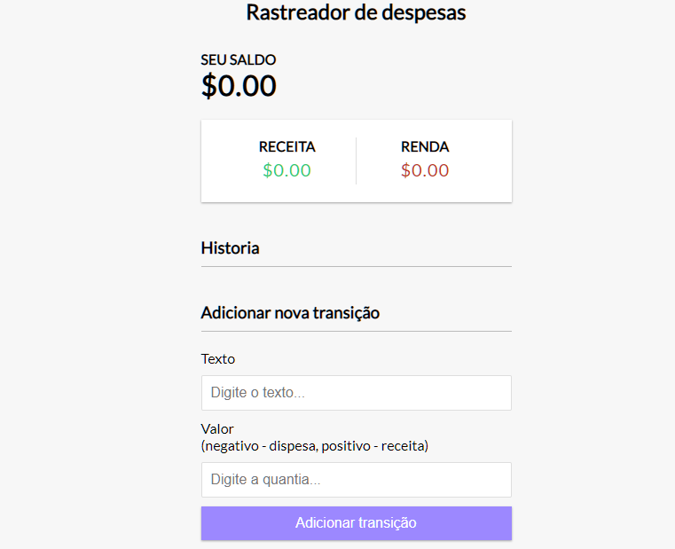

<h1 align="center"> Rastreador de despesas</h1>

  

## 🚀 Tecnologias

Esse projeto foi desenvolvido com as seguintes tecnologias:

- HTML 
- CSS
- JavaScript

## 💻 Projeto

- [Acesse o projeto finalizado, online](https://ricantony6.github.io/Rastreador-de-despesas/)

♥ Ricardo Antonio Rodrigues
